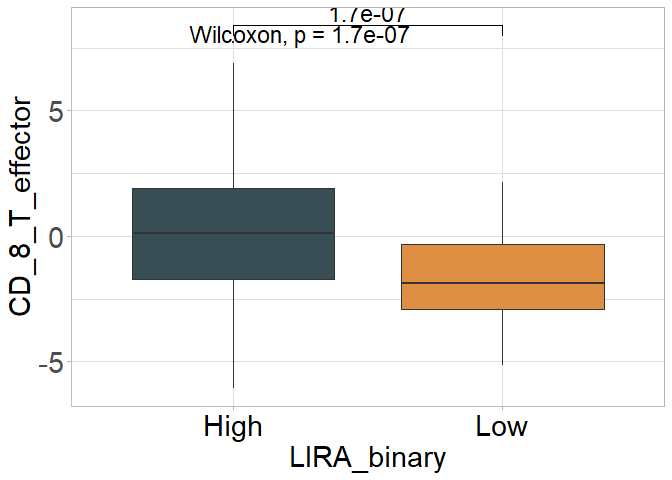

<!-- README.md is generated from README.Rmd. Please edit that file -->

# LIRA

LIRA is an R package to predict the effectiveness of immunotherapy in
patients with NSCLC.

## 1.Introduction

1.LIRA was designed to predict the reponse to immunotherapy in patients
with NSCLC. 2.This package consists a random survival model based on
expression profiles of 50 genes, which were selected through univariate
Cox regression and subgroup analysis. 3.This package provides functions
for different scenarios and allows visual assessment to determine
whether patients are suitable for immunotherapy.

## 2.Installation

It is essential that you have R 3.6.3 or above already installed on your
computer or server. Before installing LIRA, please install all
dependencies by executing the following command in R console:

The dependencies
includes`IOBR`,`crayon`,`ggplot2`,`randomForest`,`randomForestSRC`.

#### Graphical abstract for construction and clinical application of LIRA


``` r
if (!requireNamespace("BiocManager", quietly = TRUE)) install.packages("BiocManager")
depens<-c("IOBR", "crayon", "ggplot2", "randomForest", "randomForestSRC")
for(i in 1:length(depens)){
  depen<-depens[i]
  if (!requireNamespace(depen, quietly = TRUE))   BiocManager::install(depen,update = FALSE)
}

if (!requireNamespace("IOBR", quietly = TRUE))  devtools::install_github("IOBR/IOBR")
```

Then, you can start to install IOBR from github by typing the following
code into your R session:

``` r
if (!requireNamespace("LIRA", quietly = TRUE))
  remotes::install_github("LiaoWJLab/LIRA")
```

Load the IOBR package in your R session after the installation is
complete:

``` r
library(LIRA)
library(IOBR)
library(tidyverse)
```

## 3.Usage

### Obtain dataset from TCGA using UCSCXenaTools R package.

For transcriptomic data of TCGA data sets, we strongly recommend user to
use UCSCXenaTools R package. Here, we download counts data of TCGA-LUAD
from UCSC using UCSCXenaTools R package

``` r
# if (!requireNamespace("UCSCXenaTools", quietly = TRUE))
#     BiocManager::install("UCSCXenaTools")
# library(UCSCXenaTools)
# 
# eset<-XenaGenerate(subset = XenaCohorts =="GDC TCGA Lung Adenocarcinoma (LUAD)") %>% 
#   XenaFilter(filterDatasets    = "TCGA-LUAD.htseq_counts.tsv") %>% 
#   XenaQuery() %>%
#   XenaDownload() %>% 
#   XenaPrepare()

eset<- readr::read_tsv("TCGA-LUAD.htseq_counts.tsv.gz")
#> Rows: 60488 Columns: 586
#> ── Column specification ────────────────────────────────────────────────────────
#> Delimiter: "\t"
#> chr   (1): Ensembl_ID
#> dbl (585): TCGA-97-7938-01A, TCGA-55-7574-01A, TCGA-05-4250-01A, TCGA-55-697...
#> 
#> ℹ Use `spec()` to retrieve the full column specification for this data.
#> ℹ Specify the column types or set `show_col_types = FALSE` to quiet this message.
# Remove the version numbers in Ensembl ID.
eset$Ensembl_ID<-substring(eset$Ensembl_ID, 1, 15)
eset<-column_to_rownames(eset, var = "Ensembl_ID")
# Revert back to original format because the data from UCSC was log2(x+1)transformed.
eset<-(2^eset)-1
head(eset[1:5,1:5])
#>                 TCGA-97-7938-01A TCGA-55-7574-01A TCGA-05-4250-01A
#> ENSG00000000003             2032             1000             5355
#> ENSG00000000005               15                0                5
#> ENSG00000000419             1220              744             2898
#> ENSG00000000457              876              560              734
#> ENSG00000000460              250              325              785
#>                 TCGA-55-6979-11A TCGA-95-A4VK-01A
#> ENSG00000000003              516             2269
#> ENSG00000000005                0                1
#> ENSG00000000419              589              819
#> ENSG00000000457              361             1477
#> ENSG00000000460               88              327

#remove normal sample of TCGA-LUAD
eset<- eset[,!substring(colnames(eset), 14,16)=="11A"]
colnames(eset)<- substring(colnames(eset), 1,12)
summary(duplicated(colnames(eset)))
#>    Mode   FALSE    TRUE 
#> logical     513      14
eset<- eset[,!duplicated(colnames(eset))]
```

``` r
eset_tpm <- count2tpm(countMat = eset, idType = "Ensembl")
#> >>>--- Using variables (anno_grch38) and gene lengths (eff_length)  built into the IOBR package to perform TPM transformation
#> >>>--- The gene lengths (eff_length) was estimated by function `getGeneLengthAndGCContent` from EDASeq package with default parameters at 2023-02-10
#> Warning in count2tpm(countMat = eset, idType = "Ensembl"): >>>--- Omit 3154
#> genes of which length is not available !
#using phenotype data derived from TCGA paper [https://pubmed.ncbi.nlm.nih.gov/34019806/]
data(pdata_luad)
summary(pdata_luad$ID%in%colnames(eset))
#>    Mode   FALSE    TRUE 
#> logical       3     495
```

### Annotate genes in expression matrix and remove duplicate genes using IOBR package\[\].

``` r
eset <- anno_eset(eset = eset, annotation = anno_grch38, probe = "id", symbol = "symbol")
#> Row number of original eset:
#> >>>>  60488
#> >>> 99.73% of probe in expression set was annotated
#> Row number after filtering duplicated gene symbol:
#> >>>>  56011
```

## Calculate riskscore of TCGA

We offer two methods to calculate the `LIRA` score for samples in
different scenarios. One method involves calculating the score for
individual samples by inputting them into the LIRA algorithm, while the
other method involves calculating the score for multiple samples by
inputting them together. We utilize data from the OAK studies as
reference data to help users understand the distribution of scores for
their samples.

``` r
res      <- lira_model2(eset       = eset,
                        ref        = T, 
                        loop       = FALSE,
                        check_eset = T, 
                        pdata      = pdata_luad,
                        id_pdata   = "ID",
                        scale      = TRUE,
                        plot       = FALSE,
                        return_all = T)
#> >>>-- Predicting new data with combined gene expression data...
#> >>>--- This is a fuzzy calculation. We recommend that users provide expression matrices with ENSEMBL as row names
#> >>>--- Using variables (anno_grch38) and gene lengths (eff_length)  built into the IOBR package to perform TPM transformation
#> >>>--- The gene lengths (eff_length) was estimated by function `getGeneLengthAndGCContent` from EDASeq package with default parameters at 2023-02-10
#> Warning in count2tpm(countMat = eset_m, idType = gene_type, org = org, source =
#> "local"): >>>--- Omit 1253 genes of which length is not available !
#> >>>-- Scaling data...
#> >>>-- Removing outlier genes...
#> [1] ">>> Is NA exist:  0"
#> [1] ">>>> Is nonnumeric variables exist ? >>>>"
#>    Mode   FALSE 
#> logical   34196 
#> [1] ">>>> Is -Inf variables exist ? >>>>"
#>    Mode   FALSE 
#> logical   34196 
#> [1] ">>>> Is Inf variables exist ? >>>>"
#>    Mode   FALSE 
#> logical   34196 
#> [1] ">>> Variables with sd = 0 :  "
#>    Mode   FALSE 
#> logical   34196 
#> >>>-- Predicting new data with LIRA model...
#> Warning: 程辑包'randomForestSRC'是用R版本4.2.1 来建造的
#> 
#>  randomForestSRC 3.1.1 
#>  
#>  Type rfsrc.news() to see new features, changes, and bug fixes. 
#> 
#> 
#> 载入程辑包：'randomForestSRC'
#> The following object is masked from 'package:purrr':
#> 
#>     partial
#> >>>-- 96.00% of model genes appear on gene matrix
#> >>>-- DONE!
colnames(res)[2] <- "LIRA"
```

``` r
table(res$cohort)
#> 
#>  reference validation 
#>        439        513
p1<- ggplot(res, aes(x= LIRA, fill= cohort)) +
  geom_histogram(bins = 30, colour = "grey", alpha = 0.5)+
  design_mytheme(axis_angle = 0)+
  scale_fill_manual(values = palettes(palette = "jco", show_col = FALSE))
#> >>>>Options for `theme`: light, bw, classic and classic2
```

``` r
library(survminer)
#> 
#> 载入程辑包：'survminer'
#> The following object is masked from 'package:survival':
#> 
#>     myeloma
res<- res[res$cohort=="validation", ]
# head(res)
res<- best_cutoff(pdata = res, time = "os_time", status = "os_status", variable = "LIRA")
#> >>>-- The best cutoff is =  39.2382039561726
#> $best_cutoff
#> [1] ">>>-- The best cutoff is =  39.2382039561726"
#> 
#> $cox_continuous_object
#> Call:
#> coxph(formula = y ~ pdata[, which(colnames(pdata) == variable)], 
#>     data = pdata)
#> 
#>   n= 482, number of events= 178 
#> 
#>                                                coef exp(coef) se(coef)     z
#> pdata[, which(colnames(pdata) == variable)] 0.01989   1.02009  0.00826 2.408
#>                                             Pr(>|z|)  
#> pdata[, which(colnames(pdata) == variable)]    0.016 *
#> ---
#> Signif. codes:  0 '***' 0.001 '**' 0.01 '*' 0.05 '.' 0.1 ' ' 1
#> 
#>                                             exp(coef) exp(-coef) lower .95
#> pdata[, which(colnames(pdata) == variable)]      1.02     0.9803     1.004
#>                                             upper .95
#> pdata[, which(colnames(pdata) == variable)]     1.037
#> 
#> Concordance= 0.585  (se = 0.025 )
#> Likelihood ratio test= 5.96  on 1 df,   p=0.01
#> Wald test            = 5.8  on 1 df,   p=0.02
#> Score (logrank) test = 5.81  on 1 df,   p=0.02
#> 
#> 
#> $summary_binary_variable
#> High  Low 
#>   50  432 
#> 
#> $cox_binary_object
#> Call:
#> coxph(formula = y ~ pdata[, which(colnames(pdata) == variable2)], 
#>     data = pdata)
#> 
#>   n= 482, number of events= 178 
#> 
#>                                                    coef exp(coef) se(coef)
#> pdata[, which(colnames(pdata) == variable2)]Low -0.6371    0.5288   0.2036
#>                                                     z Pr(>|z|)   
#> pdata[, which(colnames(pdata) == variable2)]Low -3.13  0.00175 **
#> ---
#> Signif. codes:  0 '***' 0.001 '**' 0.01 '*' 0.05 '.' 0.1 ' ' 1
#> 
#>                                                 exp(coef) exp(-coef) lower .95
#> pdata[, which(colnames(pdata) == variable2)]Low    0.5288      1.891    0.3548
#>                                                 upper .95
#> pdata[, which(colnames(pdata) == variable2)]Low    0.7881
#> 
#> Concordance= 0.548  (se = 0.016 )
#> Likelihood ratio test= 8.48  on 1 df,   p=0.004
#> Wald test            = 9.8  on 1 df,   p=0.002
#> Score (logrank) test = 10.13  on 1 df,   p=0.001
# help("surv_group")
p2<- surv_group(
  input_pdata     = res,
  target_group    = "LIRA_binary",
  levels          = c("High", "Low"),
  reference_group = "High",
  project         = "TCGA-LUAD",
  time            = "time",
  status          = "status",
  time_type       = "day",
  break_month     = "auto",
  cols            = NULL,
  palette         = "jama",
  mini_sig        = "",
  save_path       = paste0("man/figures"))
#> >>> Dataset's survival follow up time is range between 0.13 to 241.6 months
#> High  Low 
#>   49  429
#> 49429
#>   Maximum of follow up time is 241.6 months; and will be divided into 6 sections;
#> [1] Low  High
#> Levels: High Low

p1+p2
```


``` r
tme<- calculate_sig_score(eset = eset_tpm, pdata = res, signature = signature_collection, method = "PCA")
# colnames(tme)
p1<- sig_box(data = tme, signature = "CD_8_T_effector", variable = "LIRA_binary", palette = "jama")
p2<- sig_box(data = tme, signature = "Nature_metabolism_Hypoxia", variable = "LIRA_binary", palette = "jama")
p3<- sig_box(data = tme, signature = "Ferroptosis", variable = "LIRA_binary", palette = "jama")
p4<- sig_box(data = tme, signature = "Glutathione_Metabolism", variable = "LIRA_binary", palette = "jama")
```

Combination of plots

``` r
if (!requireNamespace("patchwork", quietly = TRUE)) install.packages("patchwork")
library(patchwork)
p<-(p1|p2|p3|p4)
p + plot_annotation(tag_levels = 'A')
```



## References

1.Zeng D, Fang Y, Chen G, …, Liao W; Predicting NSCLC immunotherapy
resistance based on Random Forest Model. (2023) *Under Review*.

## Reporting bugs

Please report bugs to the [Github issues
page](https://github.com/LiaoLab/LIRA/issues)

E-mail any questions to <dongqiangzeng0808@gmail.com>
