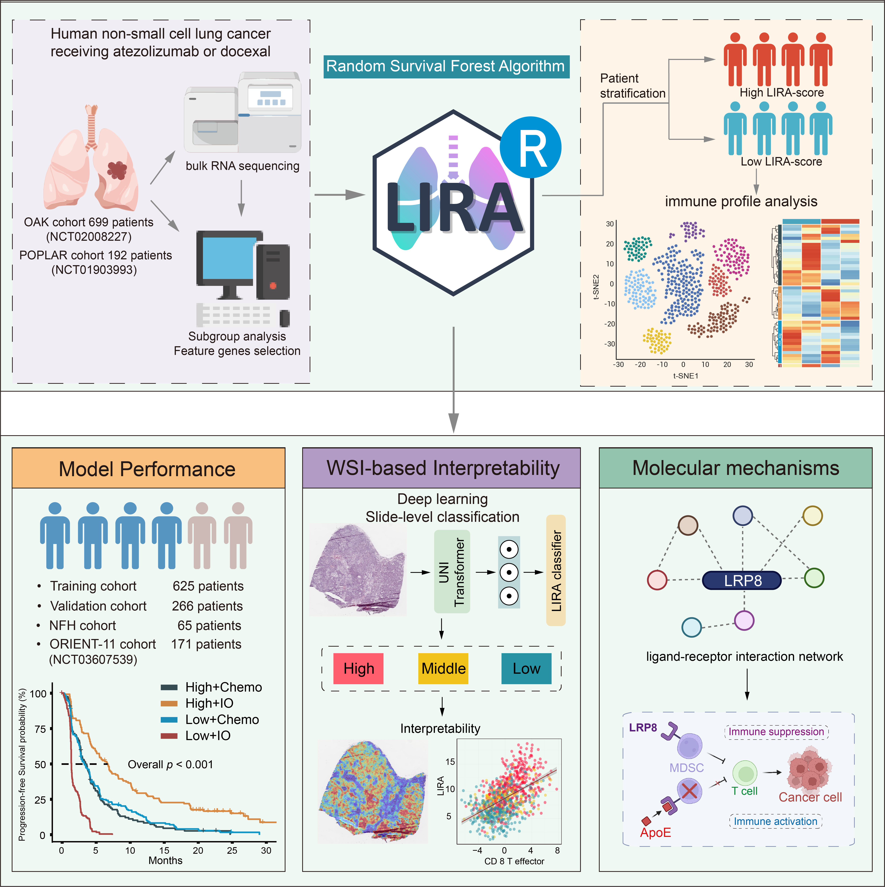
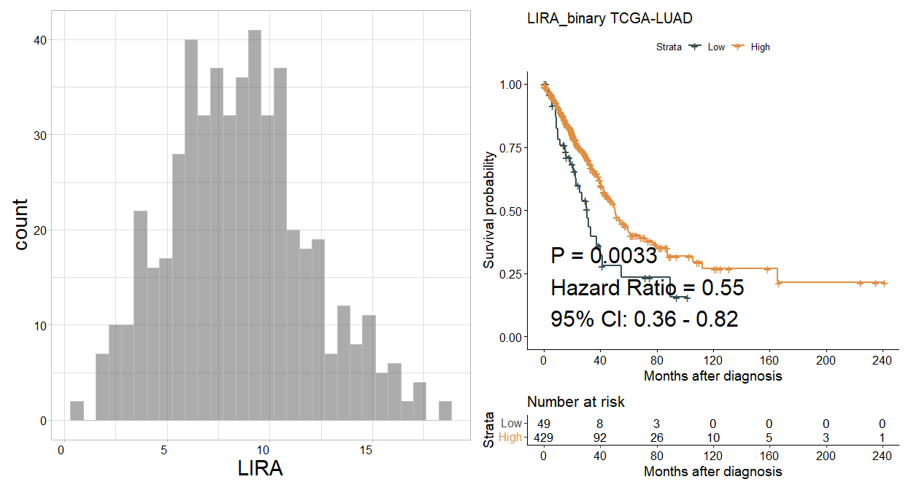

<!-- README.md is generated from README.Rmd. Please edit that file -->

# LIRA

LIRA is an R package to predict the effectiveness of immunotherapy in
patients with NSCLC.

## 1.Introduction

1.LIRA was designed to predict the response to immunotherapy in patients
with NSCLC. 2.This package consists a random survival model based on
expression profiles of 50 genes, which were selected through univariate
Cox regression and subgroup analysis. 3.This package provides functions
for different scenarios and allows visual assessment to determine
whether patients are suitable for immunotherapy.

## 2.Installation

It is essential that you have R 3.6.3 or above already installed on your
computer or server. Before installing LIRA, please install all
dependencies by executing the following command in R console:

The dependencies
includes`IOBR`,`crayon`,`ggplot2`,`randomForest`,`randomForestSRC`.

#### Graphical abstract for construction and clinical application of LIRA

<figure>

<figcaption aria-hidden="true">LIRA logo</figcaption>
</figure>

``` r
if (!requireNamespace("BiocManager", quietly = TRUE)) install.packages("BiocManager")
depens<-c( "crayon", "ggplot2", "randomForest", "randomForestSRC")
for(i in 1:length(depens)){
  depen<-depens[i]
  if (!requireNamespace(depen, quietly = TRUE))   BiocManager::install(depen,update = FALSE)
}
if (!requireNamespace("IOBR", quietly = TRUE))  devtools::install_github("IOBR/IOBR")
```

Then, you can start to install IOBR from github by typing the following
code into your R session:

``` r
if (!requireNamespace("LIRA", quietly = TRUE))
  remotes::install_github("LiaoWJLab/LIRA")
```

Load the IOBR package in your R session after the installation is
complete:

``` r
library(LIRA)
library(IOBR)
library(tidyverse)
```

## 3.Usage

### Obtain dataset from TCGA using UCSCXenaTools R package.

For transcriptome data of TCGA data sets, we strongly recommend user to
use UCSCXenaTools R package. Here, we download counts data of TCGA-LUAD
from UCSC using UCSCXenaTools R package

``` r
if (!requireNamespace("UCSCXenaTools", quietly = TRUE))
    BiocManager::install("UCSCXenaTools")
library(UCSCXenaTools)

eset<-XenaGenerate(subset = XenaCohorts =="GDC TCGA Lung Adenocarcinoma (LUAD)") %>%
  XenaFilter(filterDatasets    = "TCGA-LUAD.htseq_counts.tsv") %>%
  XenaQuery() %>%
  XenaDownload() %>%
  XenaPrepare()
```

``` r
eset<- readr::read_tsv("TCGA-LUAD.htseq_counts.tsv.gz")
# Remove the version numbers in Ensembl ID.
eset$Ensembl_ID<-substring(eset$Ensembl_ID, 1, 15)
eset<-column_to_rownames(eset, var = "Ensembl_ID")
# Revert back to original format because the data from UCSC was log2(x+1)transformed.
eset<-(2^eset)-1
head(eset[1:5,1:5])
#>                 TCGA-97-7938-01A TCGA-55-7574-01A TCGA-05-4250-01A
#> ENSG00000000003             2032             1000             5355
#> ENSG00000000005               15                0                5
#> ENSG00000000419             1220              744             2898
#> ENSG00000000457              876              560              734
#> ENSG00000000460              250              325              785
#>                 TCGA-55-6979-11A TCGA-95-A4VK-01A
#> ENSG00000000003              516             2269
#> ENSG00000000005                0                1
#> ENSG00000000419              589              819
#> ENSG00000000457              361             1477
#> ENSG00000000460               88              327

#remove normal sample of TCGA-LUAD
eset<- eset[,!substring(colnames(eset), 14,16)=="11A"]
colnames(eset)<- substring(colnames(eset), 1,12)
summary(duplicated(colnames(eset)))
#>    Mode   FALSE    TRUE 
#> logical     513      14
eset<- eset[,!duplicated(colnames(eset))]
```

### Transform count data to TPM using [IOBR package](https://iobr.github.io/book/).

``` r
eset_tpm <- count2tpm(countMat = eset, idType = "Ensembl")
#> >>>--- Using variables (anno_grch38) and gene lengths (eff_length)  built into the IOBR package to perform TPM transformation
#> >>>--- The gene lengths (eff_length) was estimated by function `getGeneLengthAndGCContent` from EDASeq package with default parameters at 2023-02-10
#> Warning in count2tpm(countMat = eset, idType = "Ensembl"): >>>--- Omit 3985
#> genes of which length is not available !
#using phenotype data derived from TCGA paper [https://pubmed.ncbi.nlm.nih.gov/34019806/]
data(pdata_luad)
summary(pdata_luad$ID%in%colnames(eset))
#>    Mode   FALSE    TRUE 
#> logical       3     495
```

### Annotating genes in expression matrix and remove duplicate genes using [IOBR package](https://iobr.github.io/book/).

``` r
eset <- anno_eset(eset = eset, annotation = anno_grch38, probe = "id", symbol = "symbol")
#> Row number of original eset:
#> >>>>  60488
#> >>> 99.73% of probe in expression set was annotated
#> Row number after filtering duplicated gene symbol:
#> >>>>  56011
```

## Calculate LIRA score of TCGA-LUAD samples

``` r
res      <-  lira_model(eset       = eset,
                        pdata      = pdata_luad,
                        id_pdata   = "ID",
                        scale      = TRUE)
#> >>>-- Scaling data...
#>  [1] "YPEL3"      "AL355075.4" "SMOC1"      "DCAF8"      "FAT1"      
#>  [6] "AKR7A3"     "INTS3"      "SETDB1"     "RNF44"      "NORAD"     
#> [11] "FAH"        "AGAP1"      "PIP5K1A"    "MAFK"       "TRAP1"     
#> [16] "LRRC66"     "KIAA0907"   "NTF4"       "RHPN2"      "RRNAD1"    
#> [21] "PRELID1P1"  "SLC25A6"    "PTRHD1"     "IGSF8"      "TRAF4"     
#> [26] "IDO1"       "CLEC6A"     "CD96"       "HCLS1"      "CST7"      
#> [31] "IGHV3_74"   "NCF1B"      "FAM162A"    "IL2RG"      "SH2D1A"    
#> [36] "CD247"      "CD3G"       "GSTO1"      "NUPR1"      "TBXAS1"    
#> [41] "CLEC12A"    "CD37"       "PRKCSH"     "YEATS2"     "CCL5"      
#> [46] "SEPT14P12"  "PPM1G"      "TFRC"       "NDUFA6"     "RAB30"     
#> >>>-- 94.00% of model genes appear on gene matrix
#> >>>-- Predicting new data with LIRA model...
#> >>>-- 96.00% of model genes appear on gene matrix
#> >>>=== This sample was testing by RNAseq and was processessed by rbatch pipline... 
#> >>>=== The LIRA score will be normalised to a range of 1-10 ... 
#> >>>-- DONE!
res <- res$score
```

``` r
p1<- ggplot(res, aes(x= LIRA)) +
  geom_histogram(bins = 30, colour = "grey", alpha = 0.5)+
  design_mytheme(axis_angle = 0)+
  scale_fill_manual(values = palettes(palette = "jco", show_col = FALSE))
#> >>>>Options for `theme`: light, bw, classic and classic2
```

``` r
library(survminer)
res<- best_cutoff(pdata = res, time = "os_time", status = "os_status", variable = "LIRA", PrintResult = FALSE)

# help("surv_group")
p2<- surv_group(
  input_pdata     = res,
  target_group    = "LIRA_binary",
  levels          = c("High", "Low"),
  reference_group = "High",
  project         = "TCGA-LUAD",
  time            = "os_time",
  status          = "os_status",
  time_type       = "day",
  break_month     = "auto",
  cols            = NULL,
  palette         = "jama",
  mini_sig        = "",
  save_path       = paste0("man/figures"))
#> High  Low 
#>  429   49 
#> [1] High Low 
#> Levels: High Low

p1+p2
```



``` r
tme<- calculate_sig_score(eset = eset_tpm, pdata = res, signature = signature_collection, method = "PCA", adjust_eset = TRUE)
# colnames(tme)
p1<- sig_box(data = tme, signature = "CD_8_T_effector", variable = "LIRA_binary", palette = "jama")
p2<- sig_box(data = tme, signature = "Nature_metabolism_Hypoxia", variable = "LIRA_binary", palette = "jama")
p3<- sig_box(data = tme, signature = "Ferroptosis", variable = "LIRA_binary", palette = "jama")
p4<- sig_box(data = tme, signature = "Glutathione_Metabolism", variable = "LIRA_binary", palette = "jama")
```

Combination of plots

``` r
if (!requireNamespace("patchwork", quietly = TRUE)) install.packages("patchwork")
library(patchwork)
p<-(p1|p2|p3|p4)
p + plot_annotation(tag_levels = 'A')
```


## References

1.Zeng D, Fang Y, Chen G, …, Liao W; Construction of An Artificial
Intelligence model for Predicting NSCLC immunotherapy Response： Results
from OAK, POPLAR and ORIENT-11 trials. (2023) *Under Review*.

## Reporting bugs

Please report bugs to the [Github issues
page](https://github.com/LiaoLab/LIRA/issues)

E-mail any questions to <dongqiangzeng0808@gmail.com>
